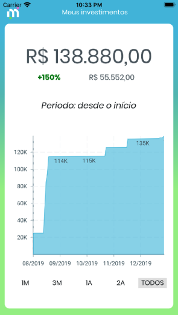

# Investimento financeiro

> Informações para o cliente sobre seus investimentos

Inicialmente o aplicativo foi desenvolvido para o usuário visualizar todo o histórico criado de seus investimentos. Mas foi projetado para que cada "Card" possua informações sobre investimentos já feito, projeções, ou até mesmo mostrar o perfil do investidor.



## Execução

Android (necessita está configurado no SO):

```sh
npm run android
```

iOS (apenas no macOS):

```sh
npm run ios
```

Android ou iOS (garantir que o "Metro" esteja rodando)

```sh
npm start
```

## Configuração para Desenvolvimento

Instalar todas as dependências para desenvolvimento

```sh
npm install ou yarn install
```

Executar suite de testes

```sh
npm test
```

## Stack

-   React
-   React Native
-   Redux
-   Redux Saga
-   Redux Persist
-   Styled Components
-   Victory Native
-   Jest
-   React Testing Library (native)

## Histórico de lançamentos

-   0.0.1
    -   Trabalho em andamento

## Melhorias

Após os componentes utilizados ficarem com frequencia das alterações estáveis, é altamente recomendado fazer testes unitários. Para componentes que possuem muitos style é recomendado tirar um snapshot.

## Meta

Lysandro Carioca – [@lysandrocb](https://twitter.com/lysandrocb) – lysandroc@gmail.com

Distribuído sob a licença MIT. Veja `LICENSE` para mais informações.

[https://github.com/lysandroc](https://github.com/lysandroc)

## Contributing

1. Faça o _fork_ do projeto (<https://github.com/Lysandroc/react-native-financial-investments>)
2. Crie uma _branch_ para sua modificação (`git checkout -b feature/investorProfile`)
3. Faça o _commit_ (`git commit -am 'Add new Card with all information about investor profile'`)
4. _Push_ (`git push origin feature/investorProfile`)
5. Crie um novo _Pull Request_
